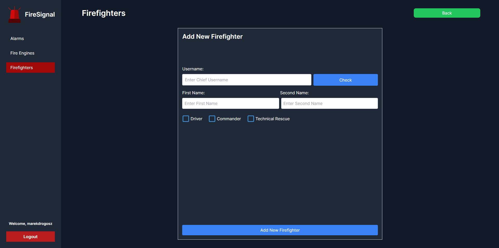
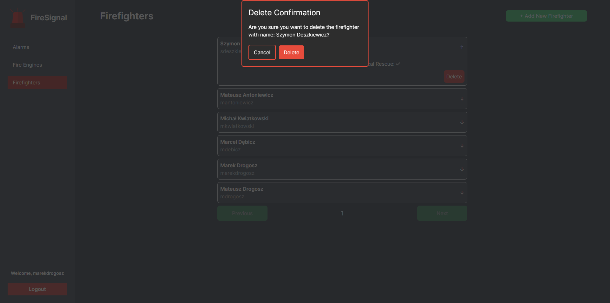

# FireSignal
Volunteer fire department system that emulates emergency dispatch management. It enables the dispatcher to input an address, geocode it for mapping, add a description and then select the available fire departments to respond to the incident. The dispatcher receives their calculated distance to the target and an approximate arrival time from an external API.

Firefighters belonging to the selected fire departments, upon logging into the desktop app (simulating a mobile app), instantly receive alarm notifications via Server-Sent Events, delivering messages in real-time. They can then decide whether they can respond to the call. The app allows them to check the number of alerted firefighters, see how many have accepted the call, determine if there's a commander or a driver, and access details such as the fire description and address.

This system enables volunteer fire departments to respond much more quickly than relying on the fire chief to receive alarm information and then individually call or text each firefighter in the department, a process that takes way too long.

The desktop app was integrated with WebSwing, allowing Swing to run in the browser. It is containerized with Docker and deployed on a server.

Spring Boot is connected to a foreign database server, also containerized, and deployed on hosting. Both the web app and the desktop app utilize it for every operation.

 

## How does it work?

1. The fire chief creates a new account.
2. Admin creates a new fire department by giving it a name and location. Then, they connect the fire chief's username to that department and add their first and last names and attributes, like if they're a driver or commander.
3. The fire chief can then log into the web app and browse all the alarms that were dispatched for the fire department. He can also add firefighters to his fire crew. He just needs to put in the firefighters' usernames and mention if they're drivers, commanders, etc.
4. Firefighters can then log in to the desktop app and receive alarm calls.

 

## Test Account Details

- **Username:** admin
- **Password:** admin

 

## Screenshots

### Web App

### Dispatch new alarm

### Add new fire department

### Login

### Add new firefighter

### Delete firefighter

### Desktop app

### Alarm message

### Alarm message

